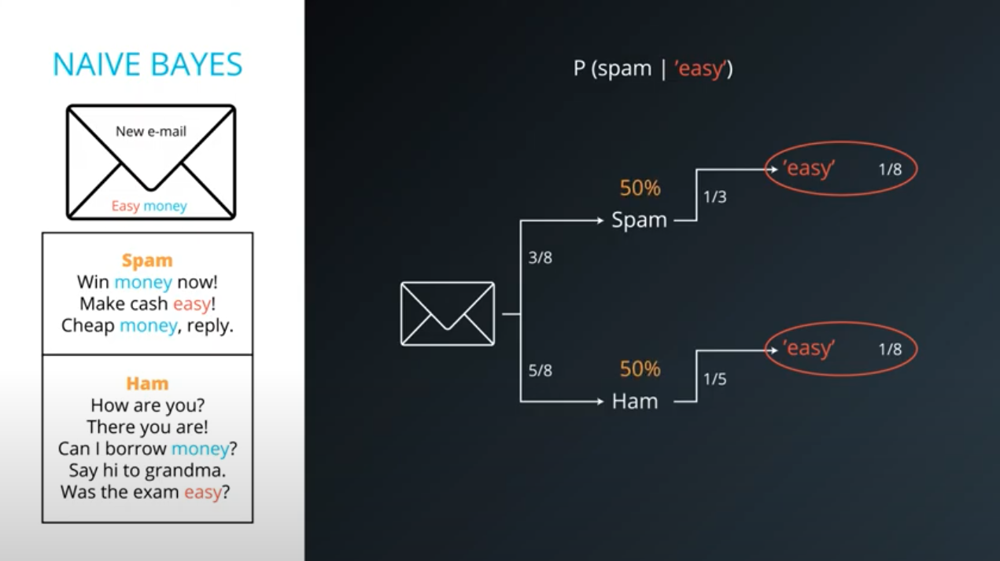
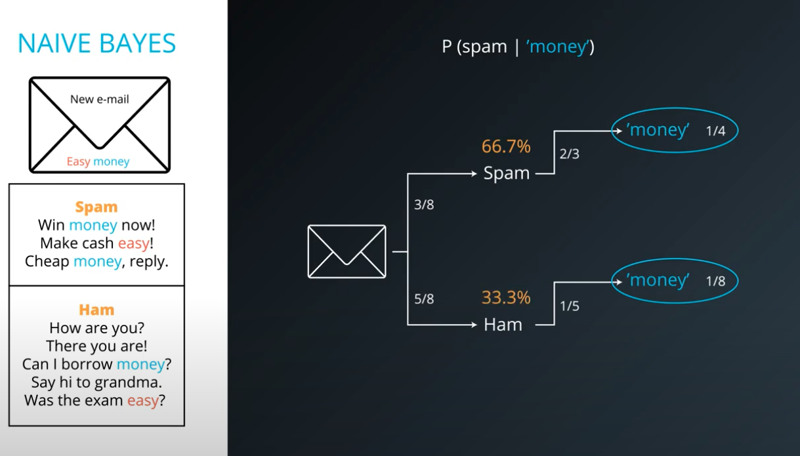
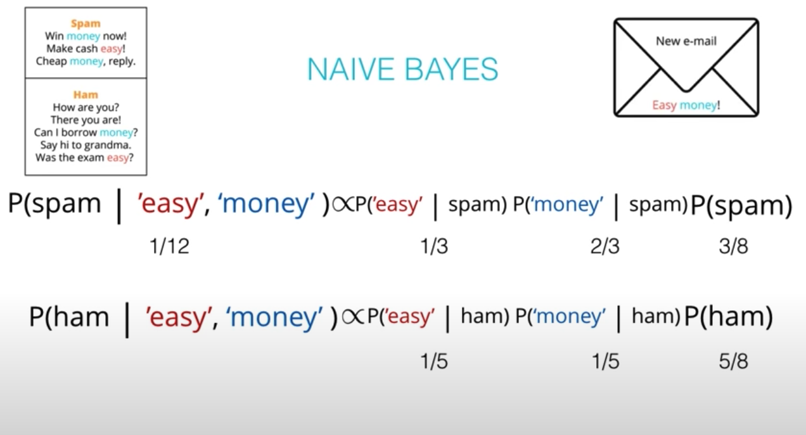
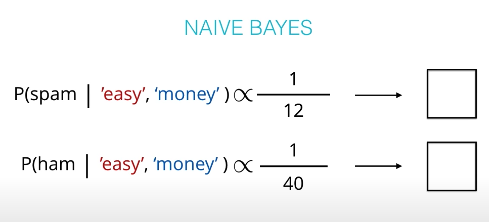
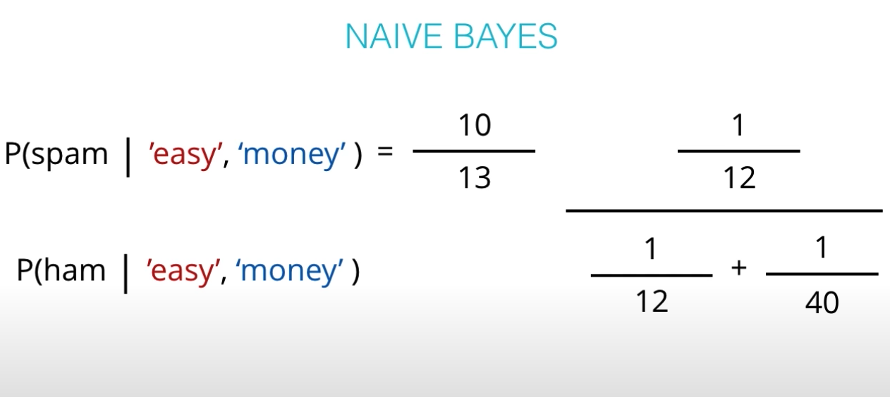
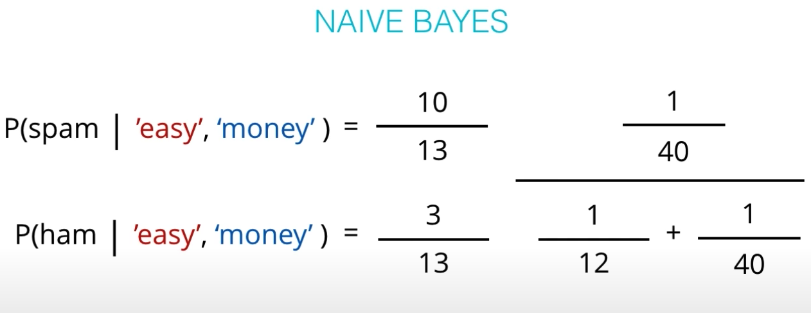

# Naive Bayes

 Naive Bayesian Algorithms are powerful tool for creating classifiers for 
incoming labeled data. Specifically Naive Bayes is frequently used with data  
and classification problems

<h1> <b>Application Bayes Theorem </b></h1>

 99% accuracy 1 out 10.000 people are sick

<h4> Information </h4>
<li>
    <ul> S = Sick</ul>
    <ul> H = Healthy</ul>
    <ul> + = Positive</ul>
</li>
<h4> Application </h4>
<li>
    <ul> P(S) = 0.0001 </ul>
    <ul> P(H) = 0.9999</ul>
    <ul> P(+|S) = 0.99</ul>
    <ul> P(+|H) = 0.01</ul>
</li>

<b>
               
P(S|+)  =  P(S) P(+ | S) / P(S) P(+ | S) + P(H) P(+ | H) 
        = 0.0001 * 0.99 / 0.0001 * 0.99 + 0.9999 * 0.01
        = 0.0098
        < 1%  
</b>

# Bayesian Learning

    
 How do we use this wonderful Bayes Theorem to do machine learning?

    <h3> example <b>spam email</b><h3>
    
    

# Naive Bayes Algorithm

    
    
    
    

