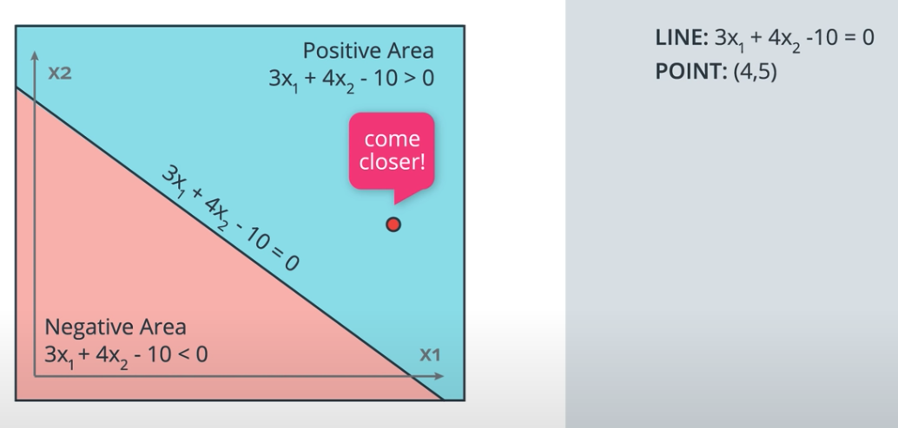

<title><b>
    Perceptron Algorithm
</title> 
<h4>
    The perceptron algorithm is an algorithm for classifying data. 
    It's the building block of neural
</h4>
<h3 style="color:green;">
    Classification Algorithm
</h3>
<h5><b>
    For example
</b></h5>

    Is this email spam or not? 
    Would this user download an app or not? 
    Is this patient sick or not?

<h1><b>
    Classification Problems
</b><h1>

    We'll start by defining what we mean by classification problems, 
    and applying it to a simple example.

<h1> Quiz #1 </h1>

<h5 style="color:red;">
    The red points to students that got rejected.
</h5>
<h5 style="color:blue;">
    The blue points to students that got accepted.
</h5>

<h1><b>
    Higher Dimensions
</b></h1>
    

<h1><b>
    Perceptron
</b></h1>
    
    
    
    
    

<h1><b>
    Perceptron as Logical Operators
</b></h1>

    In this lesson, we'll see one of the many great applications of perceptrons.  
    As logical operators! You'll have the chance to create the perceptrons for the most 
    common of these, the <b>AND</b>, <b>OR</b>, and <b>NOT</b> operators. And then, we'll see what to do about  
    the elusive <b>XOR</b> operator. Let's dive in!

    

<h1><b>
    Perceptron Algorithm Trick
</b></h1>

    n the last section you used your logic and your mathematical knowledge to create  
    perceptrons for some of the most common logical operators. In real life, though,  
    we can't be building these perceptrons ourselves. The idea is that we give them  
    the result, and they build themselves. For this, here's a pretty neat trick that 
    will help us.
    <link rel="" href="Perceptron_Algorithm/PerceptronsAsLogicalOperators.ipynb">

<h3><b>
    Time for some math!
</b></h3>

    Now that we've learned that the points that are misclassified, want the line  
    to move closer to them, let's do some math. The following video shows a mathematical 
     trick that modifies the equation of the line, so that it comes closer to a particular point.

    
    <h6 style="color:red;"> move closer to the red point</h6>
    
    <h6 style="color:red;"> move closer to the blue point </h6>
    

<h1>
    Correct Answers
</h1>
<ul>
    <li> Quiz #1 (Yes)</li>
    
    
<strong> How do we find this line? </strong>

    
</ul>

