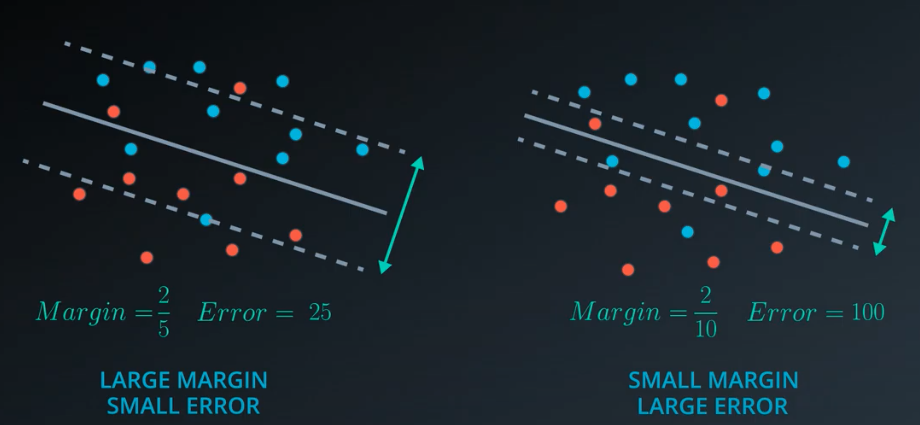

# Support Vector Machines

    Support vector machines are a common method used for classification problemas, 
    The have been proven.

# Cutting data with style

 the line must to stay very closer to all possibles points on the graph.

# Maximizing the Margin
<h2> Minimizing the Error </h2>

    ERROR = CLASSIFICATION + MARGIN ERROR

# Perceptron Algorithm

# Classification Error

    
 equantion of line is : 
        wx + b = 0
    

    

        In this case we will need two extra lines that create the margin. 
        so, we will have something like this: 
        positive (margin top line)      Wx + b = 1  
        middle  (line)                  Wx + b = 0   
        negative  (margin bottom line)  Wx + b = -1  
        <b>Step 2</b> 
        split in twice  
        the blue error starts from the bottom line and the red error 
        starts from the top line 
        now we look at values of Wx + b 
        <b> example </b> 
        blue error = 1.5, 3.5, 0.5  
        red error  = 2 + 3 + 0.3  
        Error = 1.5 + 3.5 + 0.5 + 2 + 3 + 0.3 = 10.8
    

# Margin Error

    
    
    

# Error Function

    

        Error = Classification Error + Margin Error 
        <b>Minimize using gradient descent</b>
    

    <h3> The C Paramenter </h3>
    
 
    The C parameter is just a constant that attacges itself to the classification error. 
    Error = C classification Error + Margin Error 
    Large C: Focus on classifying points 
    Small C: Focurs on a large margin 
    

# Polymonial Kernel

    
    
    

# recap

    

        In this lesson, you learned about Support Vector Machines (or SVMs). 
        SVMs are a popular algorithm used for classification problems. You saw  
        three different ways that SVMs can be implemented:

    <ol>
        <li> Maximum Margin Classifier </li>
        

            When your data can be completely separated, the linear version of  
            SVMs attempts to maximize the distance from the linear boundary to the  
            closest points (called the support vectors). For this reason, we saw that  
            in the picture below, the boundary on the left is better than the one on the  
            right.
        

        <li> Classification with Inseparable Classes </li>
        

            Unfortunately, data in the real world is rarely completely separable as shown 
            in the above images. For this reason, we introduced a new hyper-parameter called C. 
            The C hyper-parameter determines how flexible we are willing to be with the points that 
            fall on the wrong side of our dividing boundary. The value of C ranges between 0 and infinity. 
            When C is large, you are forcing your boundary to have fewer errors than when it is a small value.
        

        <li> Kernel Methods </li>
        

            By far the most popular kernel is the rbf kernel (which stands for radial basis function).  
            The rbf kernel allows you the opportunity to classify points that seem hard to separate in any space.  
            This is a density based approach that looks at the closeness of points to one another. This introduces 
            another hyper-parameter gamma. When gamma is large, the outcome is similar to having a large value of C,  
            that is your algorithm will attempt to classify every point correctly. Alternatively, small values of gamma  
            will try to cluster in a more general way that will make more mistakes, but may perform better when it sees new data.
        

    <ol>

